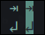
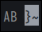
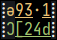
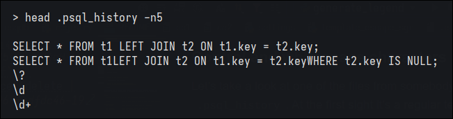
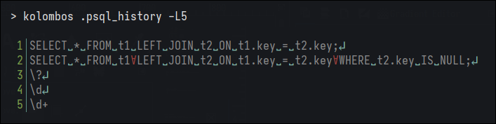
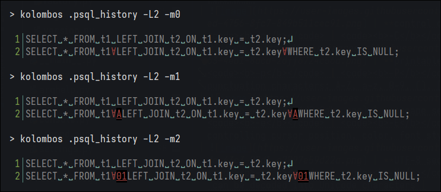
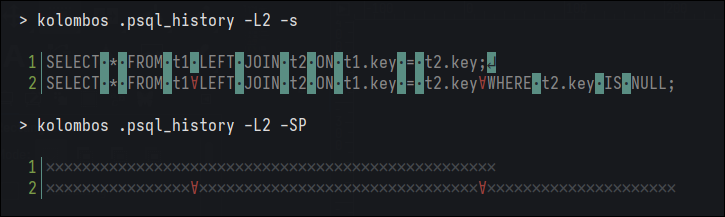
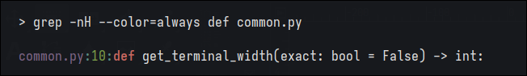
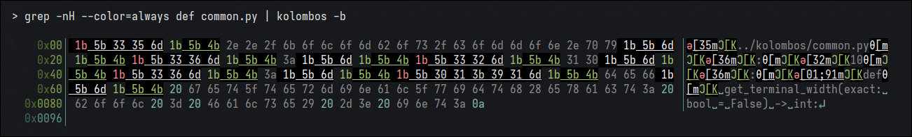
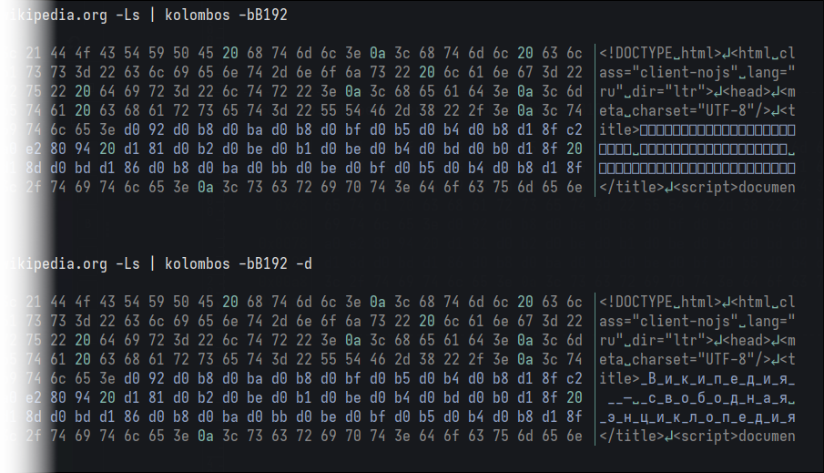

<h1 align="center">
  <code>
    kolombos
  </code>
  <br>
</h1>

CLI application for visualising usually invisible characters and bytes:

- whitespace characters;
- ASCII control characters;
- ANSI escape sequences;
- UTF-8 encoded characters;
- binary data.

## Installation

#### System-wide install (`sudo`)

    pip3 install kolombos


#### User install (no `sudo`)

    pip3 install --user kolombos

    # Add local 'pip' to PATH:
    export PATH="${PATH}:${HOME}/.local/bin/"

## Usage

Application can be useful for a variety of tasks, e.g. browsing unknown data formats, searching for patterns or debugging combinations of SGR sequences.

```
USAGE
  kolombos [[-t] | -b | -l | -v | -h] [<options>] [<file>]

POSITIONAL ARGUMENTS
  <file>                  file to read from; if empty or "-", read stdin instead

OPERATING MODE
  -t, --text              open file in text mode [this is a default]
  -b, --binary            open file in binary mode
  -l, --legend            show annotation symbol list and exit
  -v, --version           show app version and exit
  -h, --help              show this help message and exit

[...]
```

### Text mode and binary mode

`kolombos` can work in two primary modes: text and binary. The differences between them are line-by-line input reading in text mode vs. fixed size byte chunk reading in binary mode, and extended output in binary mode, which consists of text representation (similar to text mode) and hexademical byte values.

<p align="center"></p>

As you can see, some of the settings are shared between both modes, while the others are unique for one or another.

```
GENERIC OPTIONS
  -L, --max-lines <num>   stop after reading <num> lines [default: no limit]
  -B, --max-bytes <num>   stop after reading <num> bytes [default: no limit]
  -f, --buffer <size>     read buffer size, in bytes [default: 4096]
  -d, --debug             enable debug mode; can be used from 1 to 4 times, each level increases
                          verbosity (-d|dd|ddd|dddd)
  --no-color-markers      disable applying self-formatting to SGR marker details

TEXT MODE OPTIONS
  -m, --marker <details>  marker details: 0 is none, 1 is brief, 2 is full [default: 1]
  --no-line-numbers       do not print line numbers

BINARY MODE OPTIONS
  -w, --columns <num>     format output as <num>-columns wide table [default: auto]
  -D, --decode            decode valid UTF-8 sequences, print as unicode chars
  --decimal-offsets       output offsets in decimal format [default: hex format]
  --no-offsets            do not print offsets

[...]
```

### Character classes

There are 6 different _character classes_, and each of those can be displayed normally, highlighted (or _focused_) or ignored. 

| output | character class | byte ranges | focus flag | ignore flag | examples | 
| :---: | :------------- | :---: | :---: | :---: | :--- |
|  | **whitespace** | `09-0d`<br>`20` | <code><b>-s</b></code> | <code><b>-S</b></code> | space, line feed, carriage return | 
|  | **control char** | `01-08`<br>`0e-1f` | <code><b>-c</b></code> | <code><b>-C</b></code> | null byte, backspace, delete |
|  | **printable char** | `21-7e` | <code><b>-p</b></code> | <code><b>-P</b></code> | ASCII alphanumeric and punctuation characters: A-Z, a-z, 0-9, (), [] | 
|  | **escape sequence** | `1b[..]` | <code><b>-e</b></code> | <code><b>-E</b></code> | ANSI escape sequences controlling cursor position, color, font styling, and other terminal options | 
|  | **UTF-8 sequence** | _various_ | <code><b>-u</b></code> | <code><b>-U</b></code> | valid UTF-8 byte sequences that can be decoded into Unicode characters |
|  | **binary data** | `80-ff` | <code><b>-i</b></code> | <code><b>-I</b></code> | standalone non-(7 bit)-ASCII bytes |

## Examples

### Control and whitespace characters

Let's take a look at one of the files from somebody's home directory &mdash; `.psql_history`. At the first sight it's a regular text file:

<p align="center"></p>

But what if we look a bit more deeper into it?

<p align="center"></p>

`kolombos` shows us hidden until now characters &mdash; not only spaces and line breaks, but even more: some control characters, namely `01` **START OF HEADING** ASCII bytes, which `postgresql` uses to store multiline queries.

Red symbol is an example of _marker_ &mdash; special sigil that indicates invisibile character in the input. Sigils were selected with a focus on dissimilarity and noticeability, which helps to detect them as soon as possible. Control char and escape sequence markers also provide some details about original input byte(s); there are three different levels of these details in text mode. 

- Level 0 is no details, just the marker itself. 
- Level 1 is medium details (this is a default) &mdash; one extra character for control chars and varying amount for escape sequences. For most of the control characters the second char corresponds to their caret notation, e.g. `ⱯA` should be read as **^A** <sup><a href="https://en.wikipedia.org/wiki/C0_and_C1_control_codes#SOH">[wiki]</a></sup>.
- Level 2 is maximuim amount of verbosity. For control chars it's their 2-digit hexademical value. Also note `-c` option in the last example below &mdash; which tells the application to highlight control characters and make them even more noticable. 

<p align="center"></p>

Some of the control characters has unique sigils &mdash; for example, null byte (see [Legend](#legend)).

A few more examples of option combinations. First one is `--focus-space` flag, or `-s`, which can be useful for a situations where whitespaces are the points of interest, but input is a mess of different character classes.

Second example is a result of running the app with `--ignore-space` and `--ignore-printable` options; as you can see, now almost nothing is in the way of observing our precious control characters (if that's what you were after, that is):

<p align="center"></p>

### ANSI escape sequecnces

Escape sequences and their overlapping combinations were the main reason for me to develop this application. For those who doesn't know much about them here's some comprehensive materials: [[one]](https://en.wikipedia.org/wiki/ANSI_escape_code) [[two]](https://gist.github.com/fnky/458719343aabd01cfb17a3a4f7296797). 

`kolombos` can distiguish a few types of escape sequences, but most interesting and frequent type is _SGR sequence_, which consists of escape control character `1b`, square bracket `[`, one or more digit params separated by `;` and `m` character (_terminator_). Let me illustrate.

SGR sequences are used for terminal text coloring and formatting. Consider this command with the following output:

<p align="center"></p>

`kolombos` can show us what exactly is happening out there:

<p align="center"></p>

There are 3 different types of markers in the example above:

- `ǝ` is a sigil for regular SGR sequence (which for example sets the color of the following text to the red);
- `θ` is a _reset_ SGR sequence (`ESC[0m`) which completely disables all previously set colors and effects;
- `Ͻ` is _CSI sequence_ (more common sequence class which includes SGRs) &mdash; they also begin with `ESC[`, but have different terminator characters; in general, they control cursor position.
- Other types are listed in [Legend](#legend) section.

For this example binary more would be more convenient. 

<p align="center"></p>

As you can see, SGR sequence parameters (or _marker details_) has the same color as input text (but this behaviour can be disabled with `--no-color-markers` option). As a rule of a thumb, the only <u>underlined</u> bytes in `kolombo`'s output are the bytes that correspond to escape sequences' params, introducers or terminators (but not the `1b`|`ESC` character itself, though).

Now it's clear where and which sequences are located:

- `ǝ[35m` &mdash; SGR that sets text color to _magenta_;
- `Ͻ[K` &mdash; CSI that erases all characters from cursor to the end of the current line;
- `θ[m` &mdash; SGR that resets, or disables all formatting;
- `ǝ[01;91m` &mdash; SGR that sets text style to _bold_ and text color to _bright red_, etc.

Even more clear picture can be seen after launching the app with `-P` option (`--ignore-printable`):

<p align="center"></p>

Also notice that in binary mode each byte of input corresponds strictly to one hex value and one text representation character. That means that option `-m` is always equal to 2 (maximum verbosity) and cannot be changed.  

### UTF-8 and binary data

There is no limitation for input bytes range in `kolombos` text mode &mdash; binary data will be displayed with replacement character `Ḇ`:

<p align="center"></p>

But it's better and faster to work with binary data in binary mode. Valid UTF-8 sequences and escape sequences can be seen even in completely random byte data:

<p align="center"></p>

UTF-8 sequences in text mode are automatically decoded and displayed as Unicode characters. In binary mode for faster data processing they are displayed as boxes by default, but still can be decoded with `-D`|`--decode` option (note the same requirement as for escape sequence markers &mdash; hex value length must always correspond to text representation length):

<p align="center"></p>

## Legend

<p align="center"></p>

Even more information can be seen after running `kolombos --legend`.

## Changelog

### v1.0.1

- First public version.